# 游戏说明

## 游戏初始画面：

  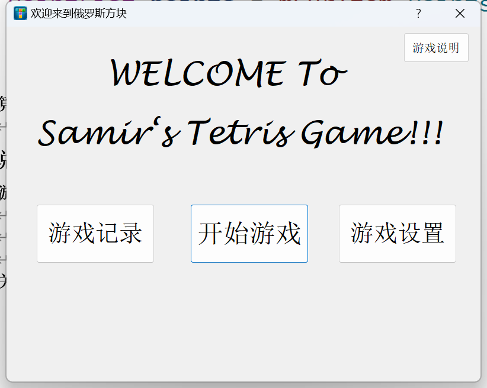

- 界面上有四个按钮供玩家选择，默认按回车开始游戏
- 点击开始游戏时：首先进入游戏模式选择，按返回键可以返回主界面

## 选择游戏模式

  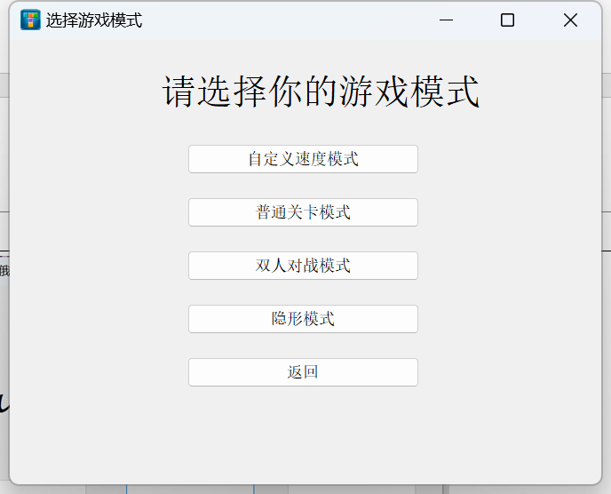

点击自定义游戏模式，普通关卡模式，隐形模式，都会弹出主窗口MainWindow：

  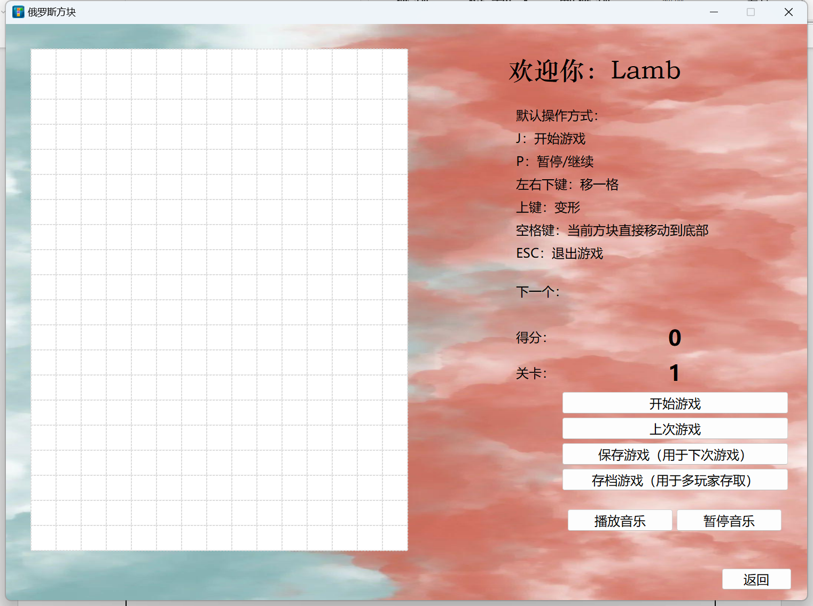

- 主界面左侧为游戏区域
- 右侧上部分为标签页，上方显示当前游戏玩家以及游戏默认操作方式。
- 下面的区域由上往下是下一个方块显示，当前分数，当前关卡。

### 按钮说明：
- 开始游戏
- 上次游戏（直接从上次游戏开始）
- 保存游戏（单击保存，可以在下次游戏时打开）
- 存档游戏（多玩家存档功能，会实现存档，但不会直接作为下次游戏打开，需要玩家在游戏记录界面设置才可以作为下次游戏打开）
- 播放音乐：打开音乐文件夹，播放音乐。
- 暂停音乐：暂停当前音乐。
- 返回：返回游戏模式选择界面

## 游戏画面：
 **单人游戏画面** 
 

  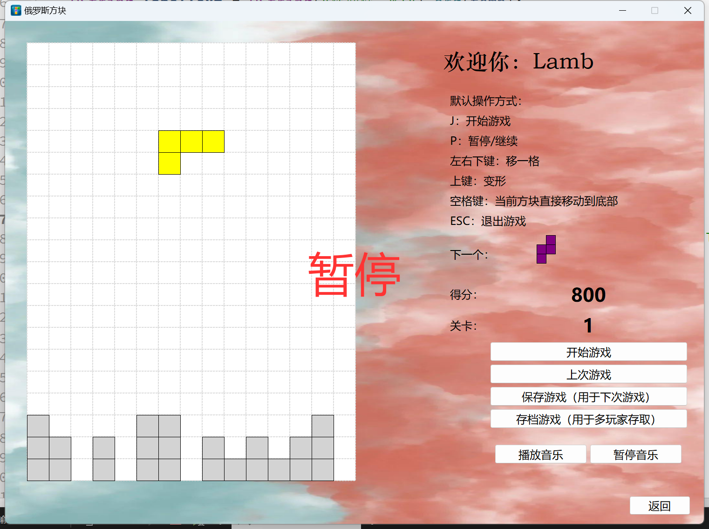

 **双人游戏画面** 
 

  

 **在初始窗口中单击游戏记录** 

  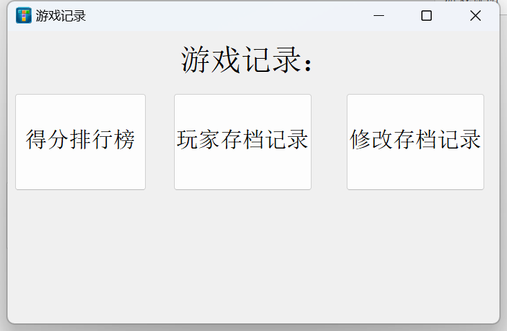

 **点击得分排行榜**:按分数排名前20位

  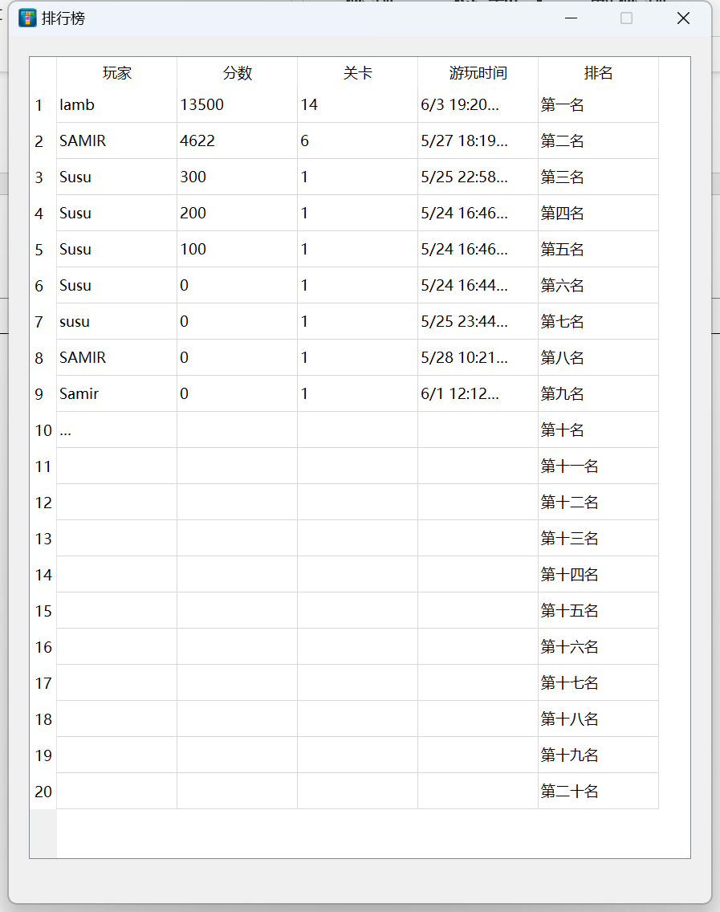

 **点击玩家存档记录** 

  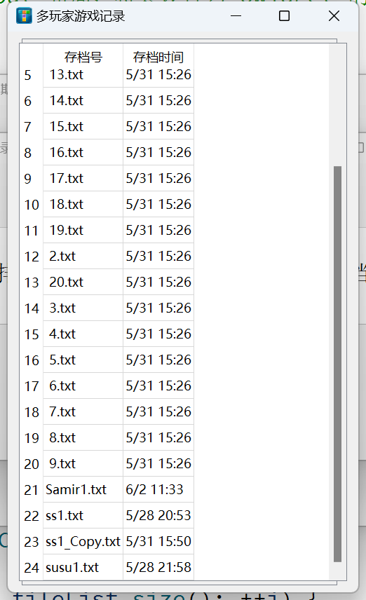

玩家需要记住存档号：即.txt前面的内容
也可以直接复制存档记录中的存档使用

 **点击修改存档记录** 

  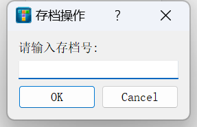

- 首先会弹出对话框，玩家需要输入存档号；
- 假如存档号不存在：会退出对话框。
- 假如存档号存在，会弹出：修改玩家历史记录界面

 **存档操作** 

  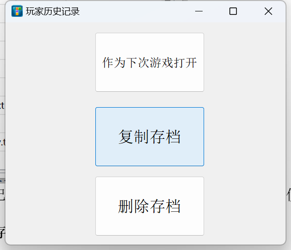

1. 单击作为下次游戏打开：该存档会保存为上次游戏，玩家在游戏界面中点击“上次游戏”即可打开。
2. 复制存档：复制一份相同内容的存档，存档号改成原存档号+_copy, 如原存档号为：susu1，则复制的存档号为：susu1_copy
3. 删除存档：即删除当前存档。

## 游戏设置：

  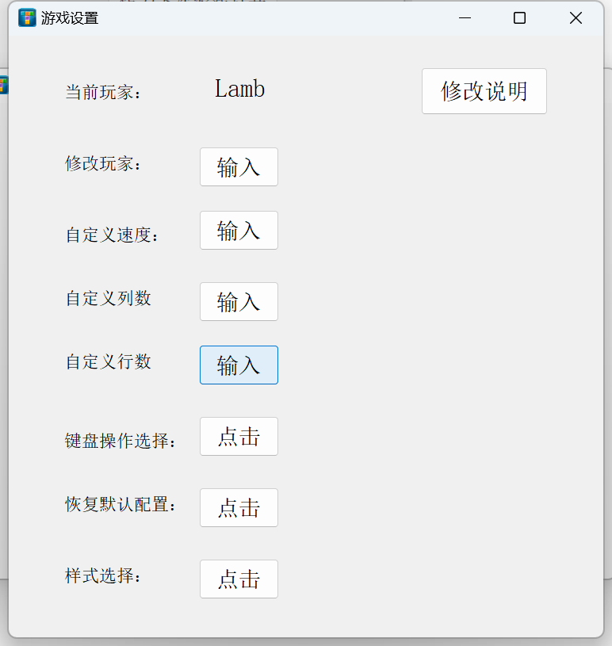

 **进入游戏设置画面** 

1. 单击修改说明：会弹出修改游戏属性时的注意事项。
2. 当前玩家：会显示当前的玩家
3. 修改玩家：修改当前玩家，可任意输入，但不能超过10个字符。
4. 点击恢复默认配置：将游戏属性恢复到默认值。
5. 自定义速度：可以选择1~10的任意一个数字，输入大于10的数字时，速度也与10相同，从1到10速度逐步加快，10是1速度的十倍。
6. 自定义列数/自定义行数：输入任意正数，行数最小等于10，列数最小也等于10。
7. 键盘操作选择：自定义修改快捷键：点击任意按钮可输入A~Z或0~9的一个字符来设置快捷键。点击恢复默认值时，自动将快捷键恢复到默认值。

 

  

 **点击样式选择** 

  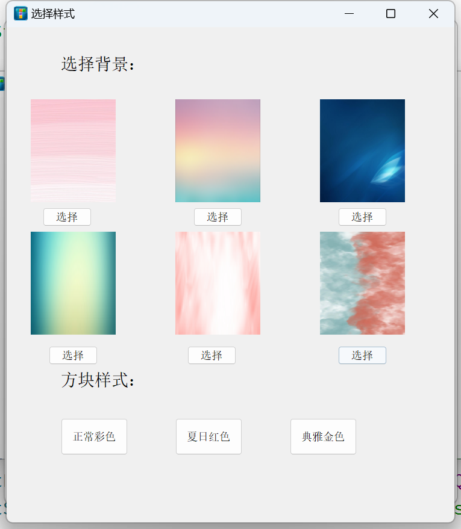

可以选择背景样式和方块样式。

